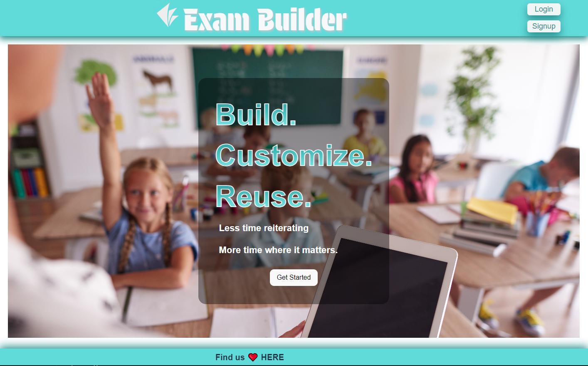

# Exam Builder

## Description
A web application for creating, administering, and taking exams, this is a collaborative MERN-stack single-page application that combines a scalable MongoDB back end, a GraphQL API, and an Express.js and Node.js server with a React front end, implementing user authentication with JWT to build a user-focused platform. 

## Table of Contents

- [Installation](#installation)
- [Usage](#usage)
- [Contributors](#contributors)
- [Other Credits](#credits)
- [License](#license)
- [Questions](#questions)

## Installation

[Exam Builder Deployed Application](https://exam-builder.onrender.com/)

## Usage

* Sign up by providing a user name, your email address, a password and an indication of whether you are an instructor, or login if you've already signed up
* For students
  * Go to your student page to view your assigned exams and grades
  * Click on an exam to take it
  * Answer the provided multiple-choice questions and click on submit
* For Instructors
  * Create new questions by providing question text, multiple-choice answers, the correct answer, and a topic
  * Create new exams by creating an exam name and a topic, then select questions to add to your exam
  * Assign exams to students

## Contributors
* Jessica Dubina ([Jessica's Portfolio Site](https://jessdubina.netlify.app/))
* Brendan McGinty ([Brendan's Github])(https://github.com/mcgintyb14)
* Warren "Trey" Lathe III ([Trey's Portfolio Site](https://stellar-figolla-219043.netlify.app))
* Kevin Hogan . ([Kevin's Portfolio Site](https://kevinhogansprofile.netlify.app/))

## Other Credits

* Node.js & Eslint Copyright [OpenJS Foundation](https://openjsf.org/) and Node.js contributors. All rights reserved.
* Concurrently Copyright © 2015 Kimmo Brunfeldt
* Apollo Server Copyright © 2016-2020 Apollo Graph, Inc. (Formerly Meteor Development Group, Inc.)
* Bcrypt Copyright © 2010 Nicholas Campbell
* Express Copyright © 2009-2014 TJ Holowaychuk <tj@vision-media.ca>,
Copyright © 2013-2014 Roman Shtylman <shtylman+expressjs@gmail.com>,
Copyright © 2014-2015 Douglas Christopher Wilson <doug@somethingdoug.com>
* Graphql Copyright © GraphQL Contributors
* Jsonwebtoken Copyright © 2015 Auth0, Inc. <support@auth0.com> (http://auth0.com)
* Mongoose Copyright © 2010-2013 LearnBoost dev@learnboost.com Copyright (c) 2013-2021 Automattic
* Apollo Client Copyright © 2022 Apollo Graph, Inc. (Formerly Meteor Development Group, Inc.)
* React & React-dom Copyright © Meta Platforms, Inc. and affiliates.
* React-router-dom Copyright © React Training LLC 2015-2019 Copyright © Remix Software Inc. 2020-2021 Copyright © Shopify Inc. 2022-2023
* Bootstrap Copyright © 2011-2024 The Bootstrap Authors
* @types/react & @types/react-dom copyrights are respective of each contributor listed at the beginning of each definition file.
* @vite/plugin-react Copyright © 2019-present, Yuxi (Evan) You and Vite contributors
* Eslint-plugin-react Copyright © 2014 Yannick Croissant
* Eslint-plugin-react-hooks Copyright © Meta Platforms, Inc. and affiliates.
* Eslint-plugin-react-refresh Copyright © [Arnaud Barré](https://github.com/ArnaudBarre)
* Vite Copyright © 2019-present, Yuxi (Evan) You and Vite contributors
* Dotenv Copyright (c) 2015, Scott Motte. All rights reserved.

## License

This application is covered under the MIT License.

## Questions

[GitHub Repository](https://github.com/JessicaDubina/exam-builder)

For questions, please contact [Jessica Dubina](mailto:jessicaclaing@gmail.com), [Trey Lathe](mailto:warrenlathe@me.com), [Brendan McGinty](brendan.mcginty14@gmail.com), or [Kevin Hogan](kchogan@pacbell.net).
